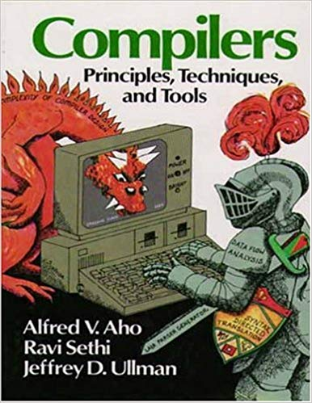

name: title-layout
layout: true
class: center, middle, title

---
name: basic-layout
layout: true
class: left, top

---
name: buhpc-logo
template: title-layout

---
name: FOAWTFT
template: title-layout
## Fantastic Optimizations
#### And Where To Find Them

---
name: FOAWTFT-Goals
template: basic-layout
## What is the point?
- To see how deep the rabit hole gets
- To only know where to seek the beasts
- To get an idea of what is happeninng behind the scenes

---
name: Dragons-Lair
template: title-layout
### Book 1: Dragon's Lair!

---
name: Dragon-Itself
template: title-layout

---
name: basic-compiler-structure
layout: basic-layout
# Basic Disection of Compiler
- Front End (Lex, Parse, AST, IR)
- Optimizer (Cleanup, Canocalization, Optimization)
- Backend (Code Generation)
